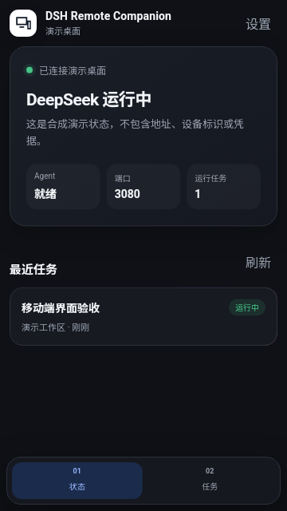
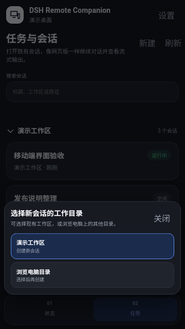
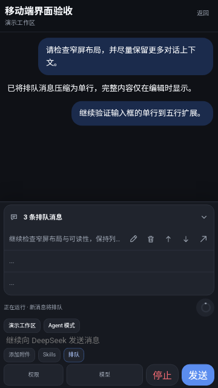

# Android 版 DSH Remote Companion

[English](README.md) | 中文

DSH Remote Companion 是 DeepSeek Harness 的社区维护第三方 Android 配套客户端，不是 DeepSeek 官方 App 或 DeepSeek 托管服务。

## 能力

- 在本地 Android WebView 壳中打开远程 DeepSeek Harness 会话。
- 保持队列紧凑：每条可见项目只占一行短文本和图标操作，展开的队列可滚动并显示完整列表。
- composer 空白时保持一行，随输入最多扩展到五行，以保留更多对话上下文空间。
- 发送和停止使用 48 px 圆形纯图标主按钮；窄屏上辅助 composer 控件保持适合触控的尺寸并支持横向滚动。
- 展示安全的上下文元数据、压缩/重试/token 上限生命周期行，以及 Host 提供的 token 和会话统计；上下文正文和诊断信息不会下发到 Android。
- 会话按“用户发言 → 最后 Agent 回复”保持安静；中间的 Think、工具调用、Code 子调用、上下文和生命周期摘要合并到一个默认收起的“运行过程”项，展开后可继续查看多层工具树、参数和结果。
- 已完成的模型回复下方提供紧凑复制图标，一键复制完整 Markdown 原文。
- 在当前会话中处理一次性工具审批、DSH 原生计划审查和通用问题组；问题组支持单选、多选、自由文本和跳过本题，保留 Host 提供的原始选项值，并在收到权威 resolved 事件后才移除操作卡片。
- 从工作区或受限的主机目录选择器创建会话，并在已配对设备上记住工作区折叠和置顶状态。

## 安装

仅为本地开发或受控模拟器验证构建和安装 Debug APK。

```powershell
Set-Location ..\..
.\build-android.ps1
```

签名后的 APK 固定输出到 `packages/dsh-android/dist/`。仓库根目录的这个脚本是唯一支持的构建入口：它会固定并校验包名、应用名称、启动图标、版本、产物名和签名证书。每次构建会删除旧 APK，只保留本次验签通过的产物。不得公开分发 Debug APK。

## 配置

通过扫描桌面插件的二维码进行配对。Android 设置页没有手工凭据输入表单。

```text
dshremote://pair?relay=https%3A%2F%2Frelay.example.com&host=<host>&token=<single-use-token>
```

自定义 scheme 仅用于 Debug。Release 构建只接受同域 HTTPS Android App Link。

## 安全模型

WebView UI 和固定版本的 `jsQR` 解码器均随 APK 打包，不加载远程页面。一次性配对 token 在兑换前会过期，兑换后的设备 token 使用 Android Keystore 的 AES-GCM 密钥加密。二维码图像和配对 token 不会发送给第三方识别服务。

## 构建与测试

使用模拟器流程前先运行本地 Android 单元测试。

```powershell
pnpm --filter @linxin666/dsh-android test
pnpm --filter @linxin666/dsh-android e2e:emulator -- http://127.0.0.1:9223
pnpm --filter @linxin666/dsh-android e2e:interactions -- http://127.0.0.1:9223
```

模拟器流程仅用于本地验证，不构成 Release APK 验收。

## 配对契约

Loopback E2E 可以使用 `dshremote://pair`。Debug 的应用内扫码也接受用户主动扫描的 HTTPS 配对链接，但链接域名必须与其中的 Relay 域名相同；外部 HTTPS intent 仍不开放。Release APK 必须使用 `https://<app-link-host>/dsh-remote/pair?...`，App Link host 必须与 relay 域名相同，并且该域名必须为 release 签名证书提供有效的 `/.well-known/assetlinks.json`。

## 公开演示素材

以下 360 x 640 截图只使用合成 fixtures，不包含真实主机路径、凭据、token、二维码或对话内容。







## 发布要求

只有提供真实 App Link 域名、受保护的 release keystore，以及该域名上匹配的 `assetlinks.json` 后，才能创建 Release APK。Release 凭据必须通过环境变量提供，不能出现在源码、命令、截图或公开文档中。

```powershell
$env:DSH_ANDROID_RELEASE_KEYSTORE = 'D:\secure\dsh-remote-release.jks'
$env:DSH_ANDROID_RELEASE_KEY_ALIAS = 'dsh-remote-companion-v1'
$env:DSH_ANDROID_RELEASE_STORE_PASSWORD = '<store-password>'
$env:DSH_ANDROID_RELEASE_KEY_PASSWORD = '<key-password>'
$env:DSH_ANDROID_RELEASE_CERT_SHA256 = '<release-certificate-sha256>'
.\build-android.ps1 -Variant Release -AppLinkHost relay.example.com
```

## 已知限制

- Git 和 SSH 控制不属于首个公开版本。
- lifecycle 控制依赖外部兼容 agent；没有该 agent 时不可用。
- Android 客户端显示 Host 提供的上下文压力、明细、token 使用量、会话统计和安全上下文元数据；不在本地估算上下文占用，也不会在手机上显示上下文正文。

代码维护和缺陷统一提交到[维护者自己的 Issue tracker](https://github.com/dd2673/dsh-web-ui/issues/1)。
